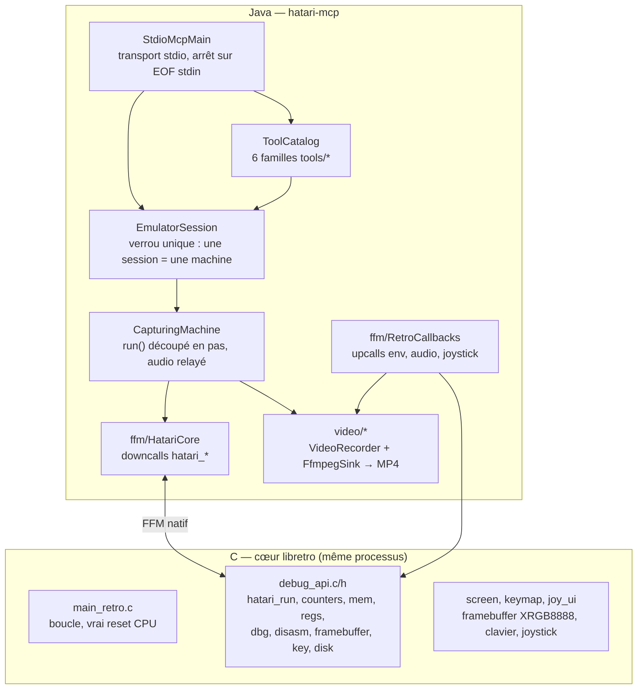

# hatari-mcp

Serveur MCP (Model Context Protocol) stdio en Java qui pilote l'émulateur
[Hatari](../readme.txt) (Atari ST/STE/TT/Falcon, CPU 68000) : exécution
trame par trame ou pas-à-pas, lecture/écriture mémoire et registres,
désassemblage, breakpoints/watchpoints, clavier, joystick, disquettes,
capture d'écran et capture vidéo MP4 avec son synchronisé. Le cœur Hatari
est chargé en mémoire via un binding FFM (Java Foreign Function & Memory
API) sur le cœur libretro `libretro-hatari.so`, sans passer par un
processus séparé.

`serverInfo` annoncé : `hatari-emulator 0.1.0`, capacité `tools`.

## Prérequis

- **Cœur Hatari compilé avec le support libretro**, dans le dépôt parent.
  L'en-tête `libretro.h` attendu par CMake vit dans
  `hatari-mcp/native/include` :

  ```sh
  mkdir -p build && cd build
  cmake -DENABLE_LIBRETRO=1 -DLIBRETRO_INCLUDE_DIR=$PWD/../hatari-mcp/native/include ..
  cmake --build . -j$(nproc)
  # produit : build/src/libretro-hatari.so
  ```

- **JDK 25** (API Foreign Function & Memory stable) :

  ```sh
  export JAVA_HOME=~/.sdkman/candidates/java/25.0.4-tem
  export PATH="$JAVA_HOME/bin:$PATH"
  ```

- **Une image TOS** dans `~/.hatari/tos.img` (EmuTOS convient et ne
  nécessite aucune licence ; c'est celle utilisée par les tests de ce
  module). Les images TOS / disquettes locales sous copyright vivent dans
  `resources/` à la racine, ignoré par git.

- **`ffmpeg` sur le `PATH`** — requis uniquement pour `arm_video_capture`
  (vérifié à l'armement, pas au démarrage).

## Lancement

```sh
hatari-mcp/scripts/hatari-mcp.sh [--core ...] [--tos ...] [--machine st] [--memsize 1]
```

Le script recompile automatiquement le jar (`mvn -q -DskipTests package`)
si les sources ou le `pom.xml` sont plus récents que
`target/hatari-mcp.jar`. La sortie Maven part sur stderr : stdout est
réservé au protocole JSON-RPC du transport stdio MCP.

Les arguments après le nom du script sont transmis tels quels à la JVM
(`"$@"`) et donc à `Options.parse` ; `--core` / `--tos` peuvent aussi
venir des variables d'environnement ci-dessous (l'option explicite gagne).

Variables d'environnement reconnues par le lanceur :

| Variable      | Défaut                                  | Rôle                          |
|---------------|------------------------------------------|--------------------------------|
| `HATARI_CORE` | `<repo>/build/src/libretro-hatari.so`     | Chemin du cœur libretro        |
| `HATARI_TOS`  | `~/.hatari/tos.img`                       | Image TOS à charger            |
| `HATARI_JDK`  | *(non défini)*                            | JDK 25 à utiliser, prioritaire sur tout le reste |
| `JAVA_HOME`   | *(hérité de l'environnement)*             | JDK de repli, utilisé en dernier |

À défaut d'option, le cœur est cherché à côté du jar
(`libretro-hatari.so`), sinon en `../build/src/libretro-hatari.so`
relatif au module. Le TOS par défaut est `~/.hatari/tos.img`.

Options CLI du serveur (`Options`, valeurs par défaut) :

| Option       | Défaut                  | Rôle                                              |
|--------------|--------------------------|----------------------------------------------------|
| `--core`     | voir ci-dessus           | `.so` libretro à charger                           |
| `--tos`      | `~/.hatari/tos.img`      | image TOS                                          |
| `--machine`  | `st`                     | `st` (CPU 8 MHz), `tt` (32 MHz), `megaste` / `falcon` (16 MHz) — fixe aussi la base de temps de la capture |
| `--memsize`  | `1`                      | Mo de RAM émulée                                   |

Le cœur est initialisé avec
`hatari --tos <tos> --machine <m> --memsize <n> --sound 44100 --confirm-quit false` :
le son est échantillonné à 44 100 Hz (`Options.AUDIO_HZ`).

Le JDK est choisi dans cet ordre :

1. `$HATARI_JDK` s'il est défini ;
2. `~/.sdkman/candidates/java/25.0.4-tem` si son `bin/java` existe ;
3. le `$JAVA_HOME` hérité de l'environnement appelant.

`$JAVA_HOME` vient en dernier parce qu'il pointe fréquemment un lien sdkman
`current` sur une version plus ancienne. Le lanceur interroge ensuite
`java.specification.version` du JDK retenu et refuse de démarrer (code de
retour 1, message sur stderr) si elle est inférieure à 25 : l'API Foreign
Function & Memory utilisée par le binding n'est stable qu'à partir de Java 25,
et un JDK plus ancien échouerait sur un `UnsupportedClassVersionError`.

Si le jar doit être reconstruit, le lanceur vérifie la présence de `mvn` dans
le `PATH` et s'arrête avec un message explicite s'il est absent.

Contrat stdio (voir `StdioMcpMain`) : stdout est réservé au JSON-RPC — le
vrai descripteur est capturé pour le transport et `System.out` est redirigé
vers stderr. Le serveur s'arrête à la fermeture de stdin (comportement
standard d'un transport MCP stdio), avec 250 ms de drain pour les réponses
en vol puis un garde-fou de 5 s (`halt(0)`) si un hook d'arrêt se bloque.

Déclaration MCP à la racine du dépôt Hatari : [`.mcp.json`](../.mcp.json)
(clé `hatari`, commande `hatari-mcp/scripts/hatari-mcp.sh`).

## Architecture

Deux moitiés, un seul processus : le C tourne la machine, Java l'expose
en outils MCP. Aucun sous-processus, aucun socket — le binding FFM appelle
le `.so` en place.



### Côté C : `src/retro/debug_api.{c,h}`

Le cœur libretro expose, en plus des entry points libretro standard, les
`hatari_*` consommés par Java (raisons `HATARI_STOP_*` reflétées dans
`Machine.StopReason`) :

- vie machine : `hatari_init_args`, `hatari_run`, `hatari_counters` (VBL +
  cycles CPU), `hatari_reset` (vrai reset CPU côté `main_retro.c`) ;
- état : `hatari_mem_read/write`, `hatari_regs_get` (20 mots 32 bits :
  D0–D7, A0–A7, PC, SR, USP, ISP), `hatari_reg_set`, `hatari_step` ;
- debugger : `hatari_dbg_command` (passerelle brute : `r`, `m`, `d`, `b`,
  `history`…), `hatari_disasm` ;
- E/S : `hatari_framebuffer` (XRGB8888), `hatari_key` (scancode),
  `hatari_disk_insert/eject`.

### Côté Java : `hatari-mcp/src/main/java/fr/hatari/mcp/`

**Entrée et session** (`fr.hatari.mcp`, racine du package) :

| Fichier | Rôle |
|---|---|
| `StdioMcpMain.java` | `main` : capture le vrai stdout pour le transport, dévie `System.out` vers stderr, ouvre le cœur (`HatariCore.open`), monte `ToolCatalog`, sert en MCP synchrone. Arrêt sur fin de stdin (drain 250 ms, garde-fou `halt(0)` à 5 s) |
| `EofSignalingInputStream.java` | interpose le stdin donné au SDK (qui n'expose aucun `onClose`) et signale la fin de flux exactement une fois — sans lui, une JVM orpheline par session |
| `EmulatorSession.java` | UNE session = UNE machine ; `read`/`mutate` sous un verrou unique : le cœur natif n'est jamais touché que par un thread à la fois. Expose le `VideoRecorder` de session |
| `CapturingMachine.java` | décore `Machine` : sans capture, délègue `run()` tel quel ; en capture, avance par pas ≤ `chunk` (`every - pending`) et notifie `recorder.advanced()` + relaie l'audio à chaque pas |
| `Machine.java` | contrat unique consommé par tous les outils (`run/step/reset`, mémoire, registres, debugger, frame, audio, clavier, joystick `JOY_*` convention IKBD, disquettes, `close`). Implémenté par `HatariCore` (réel) et `FakeMachine` (tests) |
| `ToolCatalog.java` | source unique des specs : concatène les 6 familles `tools/*` |
| `Tools.java` | fabrique `tool(nom, description, inputSchema, handler)` ; chaque handler retourne un objet sérialisé en contenu structuré + texte, ou `Result(structuré, extra)` pour ajouter des contenus (ex. image PNG). Toute exception devient un `CallToolResult` d'erreur `SimpleClassName: message` |
| `Args.java` | accès typé aux arguments : `hex()` TOUJOURS hexadécimal (`"6100"` → `$6100`, préfixes `$`/`0x` tolérés, **entier JSON nu refusé** avec message qui propose les deux lectures) ; `byteList()` même convention avec contrôle `00..FF` ; `intVal()` mixte |
| `Fmt.java` | formatage partagé : hex majuscule sans préfixe (`hex8/16/24/32`), registres + SR décodé (`t/s/ipl/x/n/z/v/c`), hexdump 16 octets/ligne |
| `Options.java` | `--core/--tos/--machine/--memsize` (+ `AUDIO_HZ = 44100`, `cpuHz()` par machine, `hatariArgs()` avec `--sound … --confirm-quit false`) |
| `McpJson.java` | fabrique le mapper Jackson 3 du SDK |

**Outils** (`tools/`, un fichier par famille, `specs()` chacun) :
`MachineTools` (ping, état, reset, `run_frames`, `run_until_pc` à `:once`
temporaire, `run_to_breakpoint`, `step`), `MemoryTools` (lecture avec
hexdump, écriture, registres, désassemblage), `DebugTools` (carte locale
`id → expression` résolue en position Hatari juste avant retrait, jamais
de `b all` inter-type, `vanished` en mode `all`), `VideoTools`
(screenshot + capture MP4), `InputTools` (clavier via table de scancodes +
joystick tenu/impulsion), `DiskTools` (insert/eject/boot).

**Binding natif** (`ffm/`) — seul endroit qui manipule `MemorySegment` :

| Fichier | Rôle |
|---|---|
| `HatariCore.java` | `SymbolLookup.libraryLookup` du `.so`, `downcallHandle` vers chaque `hatari_*` + `retro_*` (`init_args`, `load_game`, `deinit`), `Arena` partagée + buffer texte 1 Mo ; traduit les codes de retour en `RunResult`/`StopReason`, les adresses hors plage en `IllegalArgumentException` |
| `RetroCallbacks.java` | `upcallStub` enregistrés via `retro_set_*` : `env` (n'accepte que pixel-format XRGB8888 + `SUPPORT_NO_GAME`), `audioBatch` (relaie les échantillons stéréo à l'`AudioListener` courant), `inputState` (lit `joyState[port]` — le cœur échange les ports 0/1 dans `joy_ui.c` : le joystick ST port 1 est lu sur le port libretro 0), autres inertes |

**Vidéo** (`video/`) : `VideoRecorder` (état armé/non-armé, échantillonnage
toutes les `every` trames, base de temps cycles CPU, `stop()` idempotent),
`FfmpegSink`/`FrameSink` (rawvideo → H.264 + PCM → AAC, `-itsscale`),
`AudioListener` (un lot `short[]` stéréo entrelacé).

**Clavier** (`keymap/StScancodes.java`) : table ST disposition US (celle
d'EmuTOS) — lignes, `Shift` automatique, noms (`RETURN`, `F1..F10`…)
et caractères ; `press_key`/`type_keys` s'y résolvent.

**Hors `src/`** : `scripts/hatari-mcp.sh` (sélection JDK 25, rebuild du
fat jar si périmé, `exec java … --core … --tos …`), `scripts/smoke.sh`
(handshake + `ping`/`run_frames`/`screenshot` sur tube nommé),
`native/include/libretro.h` (en-tête consommé par le CMake du cœur),
`pom.xml` (Java 25, SDK MCP 2.0.0, JUnit 5, fat jar `hatari-mcp.jar`,
propriétés `hatari.core`/`hatari.tos` propagées aux tests `*IT`).

`Machine.JOY_*` suit la convention IKBD : directions en bits 0–3, fire en
bit 7 (`0x80`).

## Outils exposés

Chaque outil est un `tools/call` JSON-RPC ; les arguments ci-dessous sont
donnés à titre d'exemple (voir le code source dans `src/main/java/fr/hatari/mcp/tools/`
pour le schéma JSON complet de chacun).

### Machine (`MachineTools`)

Garde-fou par défaut de `run_until_pc` / `run_to_breakpoint` : 1000 trames
(≈ 20 s machine à 50 Hz). Tous les comptes rendus d'exécution portent
`reason` (`NONE/BREAKPOINT/STEPS/EXCEPTION/OTHER`), `frames_done`, `pc`, `vbl`.

- `ping` — `{}` → `{"ok": true, "vbl": N}`
- `machine_state` — `{}` → `vbl`, `cycles` CPU, `registers` + drapeaux
- `reset` — `{"cold": true}` (warm si `cold=false`) ; exécute ensuite
  1 trame et retourne le compte rendu + `cold`
- `run_frames` — `{"n": 300}` (`1..100000`) ; s'arrête plus tôt sur
  breakpoint/watchpoint/step
- `run_until_pc` — `{"pc": "E00D98", "max_frames": 1000}` : pose un
  breakpoint temporaire `:once`, exécute au plus `max_frames` ;
  `reached=true` si le PC a été atteint. En cas de timeout, le `:once`
  périmé est retiré du listing Hatari (recherche d'expression
  insensible à la casse/espaces, cf. `breakpointPosition`)
- `run_to_breakpoint` — `{"max_frames": 1000}` : jusqu'au prochain
  breakpoint/watchpoint
- `step` — `{"n": 1}` (`1..1000000`, défaut 1) puis 1 trame de garde
  (50 si `n > 10000`, pour un CPU en `STOP`)

### Mémoire et registres (`MemoryTools`)

- `read_memory` — `{"addr": "FF8240", "len": 64}` (défaut 64, max 65536) →
  `addr`, `len`, `bytes` (hex compact) + `hexdump`. Lire la zone IO
  (`$FF8000+`) a les mêmes effets de bord qu'un accès CPU
- `write_memory` — `{"addr": "600", "bytes": ["DE", "AD"]}` ; octets
  hors `00..FF` rejetés
- `read_registers` — `{}` : D0–D7, A0–A7, PC, SR, USP, ISP + drapeaux
- `set_register` — `{"name": "d0", "value": "1234"}` : `pc/sr/d0-d7/a0-a7/usp/isp`,
  valeur hex (`$`, `0x` acceptés)
- `disassemble` — `{"addr": "E00000", "count": 16}` (`1..256`) ; `addr`
  vaut le PC courant par défaut

### Debugger (`DebugTools`)

Les ids sont attribués par le serveur (carte locale `id → expression`,
stable) et résolus en position Hatari par expression juste avant chaque
retrait — pas de `b all`, qui effacerait aussi les points de l'autre type.
L'envoi et la mise à jour de la carte tiennent dans un seul verrou de
session : pas de fenêtre où deux appels concurrents se partageraient un id.

- `set_breakpoint` — `{"pc": "E00D98"}` → `id`, `pc`, `expression` (`pc = $...`)
- `clear_breakpoint` — `{"id": 1}` ou `{"all": true}` ; en mode `all`,
  les ids déjà disparus du listing Hatari (`:once` déclenché) sont
  reportés dans `vanished` au lieu de lever une erreur
- `set_watchpoint` — `{"addr": "FF8240", "len": 2, "label": "palette 0"}`
  (`len` ∈ 1/2/4 → suffixes `b/w/l`) ; expression
  `($ADDR).w ! ($ADDR).w` : arrête quand la valeur change
- `clear_watchpoint` — même sémantique que `clear_breakpoint`
- `list_breakpoints` — `{}` → `points` (id/kind/expression/label de CE
  serveur) + `hatari` (listing brut du debugger)
- `load_symbols` — `{"path": "~/.hatari/etos1024k.sym"}` (`~` étendu)
- `debug_command` — `{"cmd": "r"}` (passerelle brute vers le debugger
  Hatari, voir `doc/debugger.html`)

### Vidéo (`VideoTools`)

Voir la section « Capture vidéo » pour le fonctionnement interne.

- `screenshot` — `{"path": "/tmp/hatari.png"}` (`path` optionnel, défaut
  fichier temporaire) : l'image PNG est retournée **directement dans le
  résultat MCP** (`ImageContent`) ET écrite sur disque ; retourne aussi
  `path`, `width`, `height`
- `arm_video_capture` — `{"path": "/tmp/hatari.mp4", "every": 2, "scale": 2, "audio": true}` :
  dès lors, tout outil qui fait avancer la machine filme une image toutes les
  `every` trames (défaut 2 → 25 img/s) et enregistre le son du cœur (YM2149,
  DMA STE) ; MP4 H.264 + AAC encodé par `ffmpeg` (requis sur le PATH). La vidéo
  est recalée sur le temps réel émulé mesuré en cycles CPU (`-itsscale`), donc
  synchrone avec le son même quand la machine tourne à 60 ou 71 Hz. `every > 2`
  (accéléré) coupe le son. Une seule capture à la fois.
- `stop_video_capture` — `{}` : multiplexe et finalise le MP4 (idempotent),
  retourne `path`, `frames`, `emulated_frames`, `seconds`, `audio`,
  `audio_samples`, `audio_seconds`, `bytes`, `video_time_scale`.
  Rappelé après l'arrêt, renvoie le même compte rendu.
- `video_capture_status` — `{}` : `active`, `path`, `frames`,
  `emulated_frames`, `seconds`, `audio…`. Erreur si aucune capture n'a
  jamais été armée.

### Clavier et joystick (`InputTools`)

Table ST US (celle d'EmuTOS par défaut, `StScancodes`) : `press_key` accepte
un nom (`RETURN, ESC, SPACE, F1..F10, UP/DOWN/LEFT/RIGHT, TAB, BACKSPACE,
DELETE, INSERT, HOME, HELP, UNDO, CONTROL, SHIFT, ALT, CAPSLOCK`) ou un
caractère ASCII (majuscules via Shift automatique). `type_keys` refuse les
caractères non mappés en les listant.

- `press_key` — `{"key": "RETURN", "hold_frames": 2}`
- `type_keys` — `{"text": "dir\n", "hold_frames": 2, "gap_frames": 1}`
  (`\n` = RETURN)
- `set_joystick` — `{"port": 1, "up": true, "fire": true}` : état maintenu
  jusqu'au prochain appel ; `{}` relâche tout (port 1 = port jeu, défaut ;
  port ∈ 0..1)
- `press_joystick` — `{"fire": true, "frames": 4}` : impulsion pendant
  `frames` trames (défaut 2) puis relâche + 1 trame.
  Certains jeux (Xenon 2) exigent un front sur fire : préférer les impulsions
  à un fire maintenu.

### Disquettes (`DiskTools`)

- `mount_disk` — `{"path": "~/disks/game.st", "drive": 0}` (0=A, 1=B ;
  `.st, .msa, .dim, .stx, .zip…`, `~` étendu)
- `eject_disk` — `{"drive": 0}`
- `boot_disk` — `{"path": "~/disks/game.st", "frames": 300}`
  (`1..100000`, défaut 300) : insère en A:, reset à froid, exécute
  `frames` trames, retourne le compte rendu d'exécution + `path`

## Capture vidéo (détail)

`arm_video_capture` ne filme rien par lui-même : il arme un `VideoRecorder`
de session, et `CapturingMachine` découpe ensuite chaque `run()` en pas
d'au plus `chunk = every - pending` trames pour ne rater aucun échantillon,
quel que soit l'outil qui avance (`run_frames`, `run_to_breakpoint`,
`run_until_pc`, `press_key`, `press_joystick`, `boot_disk`…). Les
échantillons audio du cœur (44 100 Hz stéréo) sont relayés en direct au
recorder pendant l'avance.

Paramètres : `path` (défaut `/tmp/hatari-mcp-capture.mp4`), `every` 1..100
(défaut 2 → `fps = round(50/every)` = 25 img/s, base VBL nominale 50 Hz),
`scale` 1..8 (défaut 2 → 640×400), `audio` (défaut vrai mais forcé à faux
si `every > 2`). Erreur si une capture est déjà active — `stop` d'abord.

Encodage (`FfmpegSink`) : images RGB24 poussées via stdin de `ffmpeg` vers
un MP4 temporaire (H.264, CRF 18 — visuellement sans perte sur du pixel
art), son PCM brut vers `<nom>.audio.s16le`, puis à `stop` multiplexage
MP4 H.264 + AAC 192k avec `-itsscale` calé sur le temps réel émulé
(`cycles écoulés / fréquence CPU`, 8/16/32 MHz selon `--machine`) : la
vidéo reste synchrone avec le son que la VBL réelle soit 50, 60 ou 71 Hz
(écart < 0,001 : pas de recalage). `stop` retourne `video_time_scale`
(≈ 0,83 à 60 Hz, ≈ 0,70 à 71 Hz). Fichiers temporaires
`<nom>.video.tmp.mp4` / `<nom>.audio.s16le` à côté du MP4 final.

## Tests

```sh
export JAVA_HOME=~/.sdkman/candidates/java/25.0.4-tem
cd hatari-mcp
mvn test                       # unitaires (FakeMachine) + tests *IT si le cœur/TOS sont trouvés
mvn test -Dhatari.core=/chemin/vers/libretro-hatari.so -Dhatari.tos=/chemin/vers/tos.img
mvn verify                     # même chose via le cycle de vie complet
```

Unitaires sur `FakeMachine` : `ToolCatalogTest` (catalogue complet),
`MachineToolsTest` (garde `:once`, expressions re-imprimées par Hatari),
`MemoryToolsTest`, `DebugToolsTest` (ids stables, `vanished`),
`DiskToolsTest`, `InputToolsTest`, `VideoToolsTest`,
`FfmpegSinkTest` / `VideoRecorderTest` (recalage temporel),
`StScancodesTest`.

Les tests `*IT` (`CoreIT`, etc.) chargent le vrai cœur libretro et la vraie
image TOS ; ils sont ignorés silencieusement si `hatari.core` (par défaut
`../build/src/libretro-hatari.so`) ou `hatari.tos` (par défaut
`~/.hatari/tos.img`) n'existent pas. `CoreIT` est durci : expressions
comparées après normalisation (Hatari ré-imprime `($4000).w` en
`( $4000 ) . w`), PC exact exigé après breakpoint/step, reset depuis un PC
en RAM couvert.

## Smoke test bout en bout

```sh
hatari-mcp/scripts/smoke.sh
```

Lance le serveur, effectue le handshake MCP, appelle `ping`, `run_frames`
(300 trames) et `screenshot`, puis vérifie les réponses JSON-RPC sans passer
par un client MCP complet. stdin est un tube nommé gardé ouvert : le script
écrit les 4 requêtes puis attend les vraies réponses (`"id":2`,
`"frames_done":300`, nom du PNG), borné par un timeout de garde, avant de
fermer stdin (fin de flux = arrêt serveur). Affiche `smoke OK` et sort en
erreur (avec la sortie brute du serveur) en cas d'échec.

## Spec et plan

Conception du module : `docs/superpowers/specs/2026-09-08-hatari-mcp-design.md`,
plan d'implémentation : `docs/superpowers/plans/2026-09-08-hatari-mcp.md`.

## Licence

GPL v2+, comme le reste du dépôt Hatari (voir [`readme.txt`](../readme.txt)
et [`gpl.txt`](../gpl.txt) à la racine).
